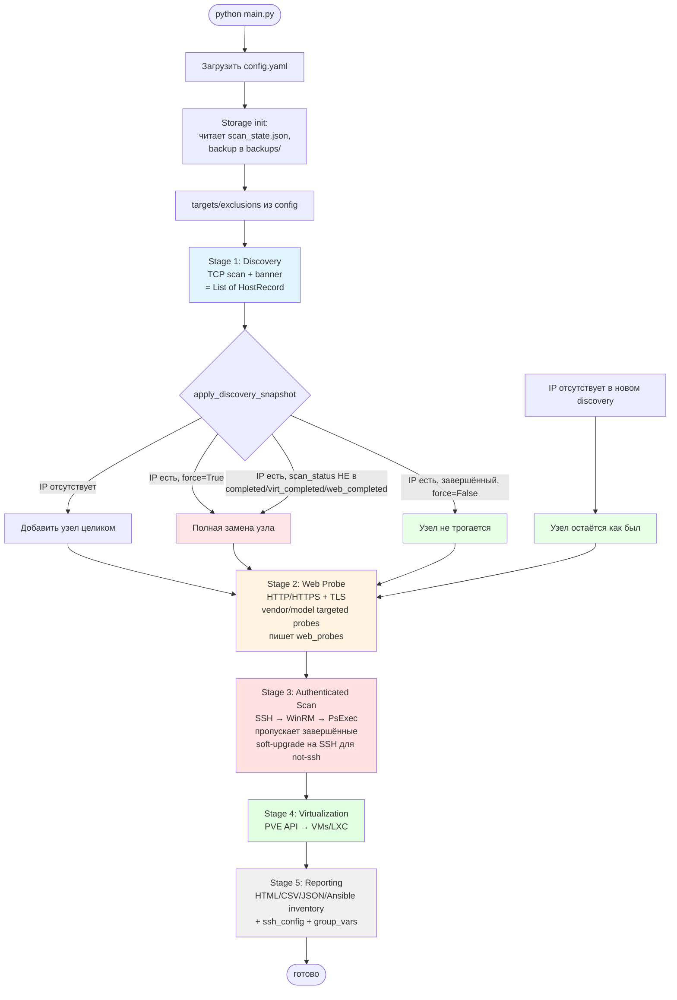

# Pipeline net-conf-gen

Точка входа — [main.py](../main.py). Запуск: `python main.py [--step STEP] [--force] [--host IP] [--config PATH]`.

`STEP` ∈ `{discovery, web, scan, virt, report, all}`. По умолчанию — `all` (все шаги по порядку).

## Этапы

| Этап | discovery | web | scan | virt | report |
|---|---|---|---|---|---|
| **Что делает** | Сетевой скан: ICMP + TCP-portscan по `ports.json`, banner-grabbing, reverse DNS, ARP→MAC. Предварительная классификация по портам/баннерам. | HTTP/HTTPS-запросы к web-портам, разбор Server-header / title / Location / WWW-Authenticate / TLS cert. Таргетированные пробы для известных вендоров (Kyocera, HP, Brother, Canon, Epson, TP-Link, SNR, RVi, XMEye, ONVIF SOAP). RTSP-проба для камер. | SSH/WinRM/PsExec-подключения по списку credentials. Чтение hostname / OS / kernel / MAC. Финальная классификация на основе данных аутентифицированной сессии. | Для PVE-хостов (vendor=Proxmox, scan_status=completed) — Proxmox API, список VMs / LXC. | Генерация всех output-файлов из storage. Не меняет storage. |
| **Источник** | [src/discovery.py](../src/discovery.py) | [src/web_probe.py](../src/web_probe.py) | [src/enrichment.py](../src/enrichment.py) + [src/connectors/](../src/connectors/) | [src/virtualization_enrichment.py](../src/virtualization_enrichment.py) | [src/reporting.py](../src/reporting.py) |
| **Заполняет поля** | `ip`, `hostname`, `mac`, `vendor` (MAC-vendor), `open_ports`, `services`, `service_details`, `category`, `type`, `os_type`, `os`, `scan_status` (`discovered` / `scanned`) | `web_probes` (dict per port: server/title/location/www_authenticate/tls_*), `vendor`, `model`, `category`, `type`, `os_type`, `os`, `scan_status` (`web_completed` если для printer/network/camera нашлись vendor+model) | `auth_method`, `auth_methods`, `auth_attempts`, `user`, `key_path`, `success`, `hostname`, `os`, `os_type`, `category`, `type`, `vendor`, `model`, `mac`, `kernel_version`, `distribution`, `scan_status` (`completed` / `auth_available_no_access`) | `vm_host`, `vms`, `scan_status` (`virtualization_completed`) | — (только output-файлы) |
| **Output-файлы** | `output/<domain>/scan_state.json` (через storage) | `output/<domain>/scan_state.json` | `output/<domain>/scan_state.json` | `output/<domain>/scan_state.json` | `hosts.txt`, `scan_report.csv/json/yaml/html`, `inventory.yaml`, `inventory_full.yaml`, `group_vars/*.yml`, `secrets.yaml`, `ssh_config` |
| **Эффект `--force`** | Полная замена узла даже если он `completed/virt_completed/web_completed`. Без `--force` завершённые узлы не трогаются. | — (не зависит от `--force`) | — (не зависит от `--force`; завершённые узлы пропускаются всегда, для них работает только soft-upgrade на SSH) | — (только для `scan_status=completed` хостов, помеченных Proxmox) | — |

## Storage

Файл `output/<domain>/scan_state.json` — единственное состояние, всё остальное генерится из него.

Формат:
```json
{
  "meta": {"version": 1, "last_scan": "2026-05-15T21:30:00"},
  "hosts": {
    "10.0.0.1": { "ip": "...", "hostname": "...", "open_ports": [...], "web_probes": {...}, "auth_*": ..., "vm_*": ..., "scan_status": "...", "last_updated": "..." }
  }
}
```

Старый плоский формат `{<ip>: {...}}` читается backward-compat, при первом `flush()` мигрирует на новый.

При каждом запуске `Storage.__init__` копирует текущий файл в `output/<domain>/backups/scan_state_<YYYYMMDD-HHMMSS>.json`. Ротация — последние 30 файлов.

## Семантика статусов

| `scan_status` | Что значит | Куда идёт дальше |
|---|---|---|
| `discovered` | Хост найден discovery, но не сканировался | scan-step попробует auth |
| `scanned` | Discovery с банерами/портами, без полного enrichment | web/scan/virt попробуют обработать |
| `auth_available_no_access` | Есть сервис auth (ssh/winrm/psexec), но логин не прошёл | Может перейти в `completed` при правильных кредах |
| `web_completed` | Web-проба нашла vendor+model для устройства без auth (камера, принтер, сетевое) | Финальное состояние для устройств без auth |
| `completed` | Аутентификация прошла, hostname/os получены | Финальное; для PVE может перейти в `virtualization_completed` |
| `virtualization_completed` | PVE-хост, собрана информация о VM/LXC | Финальное |

«Завершённые» статусы (не трогаются на следующих прогонах без `--force`): `completed`, `virtualization_completed`, `web_completed`.

## Схема пайплайна



## Где категория устанавливается

Категория (`category` ∈ `{linux, windows, mikrotik, network, printer, camera, ipkvm, unknown}`) ставится в нескольких местах:

| Этап | Кем | На основе чего |
|---|---|---|
| discovery | `classify_host()` в [src/classification.py](../src/classification.py) | open_ports + text (vendor, hostname, os, service_details) — **слабый сигнал**, для PVE/Proxmox без явного маркера `linux` даёт `unknown` |
| web probe | `classify_host()` после `_apply_probe_results` | text **+ web_probes** (server header, TLS issuer, title) — сильнее, может дать `printer`/`camera`/`network` через сигнатуры серверов |
| authenticated scan | `_build_final_model()` в [src/enrichment.py](../src/enrichment.py) | результат SSH/WinRM-сессии: `os` (`Linux`/`Windows`/`Ubuntu`/`Microsoft Windows ...`) — **самая авторитетная** |

**Важно:** для Linux-хостов (особенно PVE) категория `linux` обычно ставится **только на scan-этапе** через SSH-полученный `os='Linux'`. Если на следующем `--force` SSH не подключится (rate-limit, флакс), узел зависнет в `unknown` пока не пройдёт scan заново.

## Что значит `--force`

Только на discovery: «делать полную замену даже завершённых узлов».

- **Без `--force`**: discovery дополняет state. Завершённые узлы пропускаются. Хосты, не найденные в этом discovery, остаются. Лучший режим для регулярных прогонов.
- **С `--force`**: discovery перезаписывает все найденные узлы (теряются `web_probes`, `auth_*`, `vm_*`, классификация — кроме того что вернёт raw discovery). Хосты, не найденные в этом discovery, всё равно остаются.

Web/scan/virt-этапы **не используют `--force`** — они обрабатывают только незавершённые узлы. Для scan дополнительно работает soft-upgrade на SSH (если завершённый узел имеет открытый 22 и метод не ssh).

## Бэкап и откат

Все бэкапы в `output/<domain>/backups/scan_state_<YYYYMMDD-HHMMSS>.json`. Хранятся последние 30.

Откат состояния: `cp output/<domain>/backups/scan_state_<TS>.json output/<domain>/scan_state.json`, потом `python main.py --step report` чтобы перегенерить отчёты.
